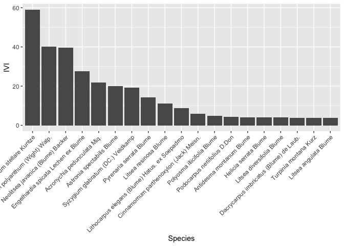
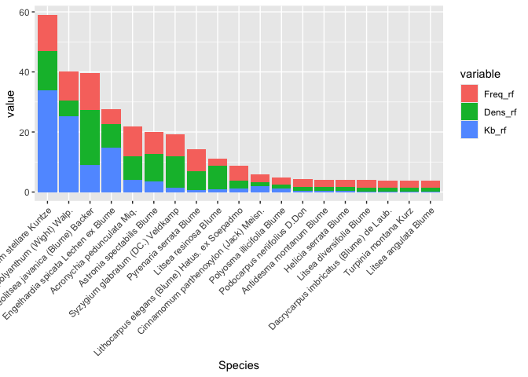

<!-- README.md is generated from README.Rmd. Please edit that file -->

# ecofor

<!-- badges: start -->
<!-- badges: end -->

The goal of ‘ecofor’ package is to offer tools that simplify routine
analysis in forest ecology.

## Installation

You can install the development version of ecofor from
[GitHub](https://github.com/) with:

``` r
# install.packages("pak")
pak::pak("fahrihasby/ecofor")
```

or with:

``` r
#install.packages("devtools")
devtools::install_github("fahrihasby/ecofor")
```

## Example

This is a basic example which shows you how to calculate the importance
value index of tree species at a sampling plot:

``` r
library(ecofor)
IVI(Papandayan)
#> # A tibble: 19 × 5
#>    Species                                        Freq_rf Dens_rf   Kb_rf   IVI
#>    <fct>                                            <dbl>   <dbl>   <dbl> <dbl>
#>  1 Distylium stellare Kuntze                        12.2    13.0  33.9    59.1 
#>  2 Syzygium polyanthum (Wight) Walp.                 9.76    5.19 25.2    40.1 
#>  3 Neolitsea javanica (Blume) Backer                12.2    18.2   9.13   39.5 
#>  4 Engelhardia spicata Lechen ex Blume               4.88    7.79 14.9    27.5 
#>  5 Acronychia pedunculata Miq.                       9.76    7.79  4.17   21.7 
#>  6 Astronia spectabilis Blume                        7.32    9.09  3.49   19.9 
#>  7 Syzygium glabratum (DC.) Veldkamp                 7.32   10.4   1.43   19.1 
#>  8 Pyrenaria serrata Blume                           7.32    6.49  0.552  14.4 
#>  9 Litsea resinosa BIume                             2.44    7.79  1.01   11.2 
#> 10 Lithocarpus elegans (Blume) Hatus. ex Soepadmo    4.88    2.60  1.31    8.78
#> 11 Cinnamomum parthenoxylon (Jack) Meisn.            2.44    1.30  2.08    5.82
#> 12 Polyosma illicifolia Blume                        2.44    1.30  1.19    4.92
#> 13 Podocarpus neriifolius D.Don                      2.44    1.30  0.462   4.20
#> 14 Antidesma montanum Blume                          2.44    1.30  0.346   4.08
#> 15 Helicia serrata Blume                             2.44    1.30  0.280   4.02
#> 16 Litsea diversifolia Blume                         2.44    1.30  0.229   3.97
#> 17 Dacrycarpus imbricatus (Blume) de Laub.           2.44    1.30  0.182   3.92
#> 18 Turpinia montana Kurz                             2.44    1.30  0.152   3.89
#> 19 Litsea angulata Blume                             2.44    1.30  0.0628  3.80
## basic example code
```

You can also take advantage of the ‘ggplot2’ package to visualise the
importance value index, for example:

``` r
library(ecofor)
df <- IVI(Papandayan)
library(ggplot2)
ggplot(data = df, aes(reorder(Species, -IVI),IVI)) +
  geom_bar(stat = "identity") +
  labs(x = "Species", Y = "Importance value index") + 
  theme(axis.text.x = element_text(angle = 45, hjust = 1))
```



or you can also display the component with this

``` r
library(ecofor)
library(data.table)
df <- melt(IVI(Papandayan)) # melt data
#> Warning: The melt generic in data.table has been passed a tbl_df and will
#> attempt to redirect to the relevant reshape2 method; please note that reshape2
#> is superseded and is no longer actively developed, and this redirection is now
#> deprecated. To continue using melt methods from reshape2 while both libraries
#> are attached, e.g. melt.list, you can prepend the namespace, i.e.
#> reshape2::melt(IVI(Papandayan)). In the next version, this warning will become
#> an error.
#> Using Species as id variables
df <- df[df$variable != "IVI",] # filter out IVI
df$Species <- factor(df$Species, levels = unique(df$Species))#keep order of Species

library(ggplot2)
ggplot(data = df[df$variable != "IVI",], 
       aes(Species, value, fill = variable)) +
  geom_bar(position = "stack", stat = "identity") +
  labs(x = "Species", Y = "Importance value index") + 
  theme(axis.text.x = element_text(angle = 45, hjust = 1))
```


